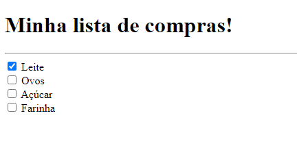

<h1 align="center"> Lista de Compras </h1>

 

  

## 🚀 Tecnologias

Esse projeto foi desenvolvido com as seguintes tecnologias:

- HTML
- Git e Github

## 💻 Projeto

A Lista de Compras foi um desafio que me submeti a realizar utilizando o HTML para testar minhas capacidades!!

- [Acesse as condições do desafio!](https://efficient-sloth-d85.notion.site/3-Lista-de-compras-91ff11e5af754cb48b51ff56e272a89d)

## :memo: Licença

Esse projeto está sob a licença MIT.

---